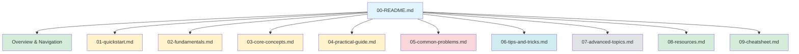
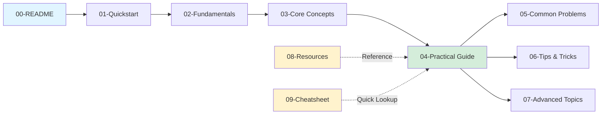

# 📚 LEARNING

  

### *Structured Learning Guides for Modern Technologies*

**Comprehensive, beginner-friendly guides with practical examples, troubleshooting, and quick references.**

---

## 🎯 What is This?

The **LEARNING** folder contains structured, comprehensive learning guides for technologies, tools, and frameworks. Each guide follows a consistent format designed to take you from zero to proficiency with:

- ✅ **Quickstart guides** - Get running in 5 minutes
- ✅ **Fundamentals** - Essential background knowledge
- ✅ **Core concepts** - Deep dives into key topics
- ✅ **Practical tutorials** - Real-world examples
- ✅ **Troubleshooting** - Common problems and solutions
- ✅ **Tips & tricks** - Productivity shortcuts
- ✅ **Advanced topics** - Power user features
- ✅ **Resources** - Curated links and references
- ✅ **Cheat sheets** - Quick reference guides

---

## 📖 Available Learning Guides

| Guide | Description | Status | Last Updated |
|:------|:------------|:------:|:------------:|
| **[n8n](./n8n/)** | Workflow automation platform - Connect apps, automate tasks, build AI agents | ✅ Complete | January 2026 |
| *More guides coming soon...* | | | |

---

## 🗂️ Guide Structure

Each learning guide follows this standardized structure:

### File Breakdown

| File | Purpose | Estimated Time |
|:-----|:--------|:--------------:|
| **00-README.md** | Overview, prerequisites, learning path | 5 min |
| **01-quickstart.md** | Get started in 5 minutes | 5-10 min |
| **02-fundamentals.md** | Essential background knowledge | 20-30 min |
| **03-core-concepts.md** | Deep dive into key concepts | 45-60 min |
| **04-practical-guide.md** | Step-by-step tutorials | 1-2 hours |
| **05-common-problems.md** | Troubleshooting guide | 30-45 min |
| **06-tips-and-tricks.md** | Productivity shortcuts | 30-45 min |
| **07-advanced-topics.md** | Advanced features & patterns | 1-2 hours |
| **08-resources.md** | Curated links & references | Reference |
| **09-cheatsheet.md** | Quick reference guide | Reference |

---

## 🚀 How to Use These Guides

### For Beginners

1. **Start with the README** - Understand prerequisites and learning path
2. **Follow the quickstart** - Get hands-on immediately
3. **Read fundamentals** - Build essential background knowledge
4. **Master core concepts** - Understand the "why" and "how"
5. **Practice with tutorials** - Build real-world projects
6. **Reference as needed** - Use cheat sheets and troubleshooting guides

### For Experienced Users

- Jump to **advanced topics** for power features
- Use **cheat sheets** for quick syntax reference
- Check **tips & tricks** for optimization
- Reference **resources** for official docs

### Learning Path Recommendation

---

## 📚 Current Guides

### 🔄 n8n - Workflow Automation

**Complete guide to n8n workflow automation platform**

- **What you'll learn**: Build automated workflows, connect 350+ apps, create AI agents
- **Difficulty**: Beginner to Advanced
- **Time to proficiency**: 4-6 hours
- **Prerequisites**: Basic JSON/API knowledge helpful but not required

**Quick Links:**
- [📖 Full Guide](./n8n/00-README.md)
- [⚡ Quickstart](./n8n/01-quickstart.md)
- [📋 Cheat Sheet](./n8n/09-cheatsheet.md)

---

## 🎓 Learning Philosophy

These guides are designed with these principles:

### ✅ Beginner-Friendly
- Concepts explained simply
- No jargon without definitions
- Real-world analogies
- Progressive disclosure (simple → complex)

### ✅ Practical & Actionable
- Copy-paste ready code examples
- Step-by-step tutorials
- Real-world use cases
- Troubleshooting guides

### ✅ Comprehensive
- Covers fundamentals to advanced topics
- Multiple learning resources
- Visual diagrams and examples
- Quick reference materials

### ✅ Up-to-Date
- Current best practices
- Latest features and updates
- Modern tooling and patterns
- Active maintenance

---

## 🔮 Upcoming Guides

Guides planned for future addition:

| Topic | Status | ETA |
|:------|:------:|:---:|
| **React** | Planning | TBD |
| **TypeScript** | Planning | TBD |
| **Docker** | Planning | TBD |
| **Kubernetes** | Planning | TBD |
| **FastAPI** | Planning | TBD |
| **PostgreSQL** | Planning | TBD |

> [!TIP]
> **Suggest a guide**: Have a technology you'd like to see a comprehensive guide for? The guides are created using a structured approach that can be applied to any technology.

---

## 📊 Guide Statistics

| Metric | Count |
|:-------|:-----:|
| **Total Guides** | 1 |
| **Total Pages** | 10 |
| **Total Words** | ~15,000+ |
| **Code Examples** | 50+ |
| **Diagrams** | 10+ |
| **Troubleshooting Solutions** | 15+ |

---

## 🛠️ Guide Format Standards

All guides follow consistent formatting:

### Visual Elements
- **Mermaid diagrams** for architecture and flows
- **Tables** for quick reference and comparisons
- **Code blocks** with syntax highlighting
- **Markdown callouts** (NOTE, TIP, WARNING, IMPORTANT)

### Content Structure
- Clear headings hierarchy
- Progressive complexity
- Practical examples
- Links between related sections
- Current date timestamps

### Quality Standards
- Beginner-friendly explanations
- Real-world use cases
- Troubleshooting included
- Resources curated
- Cheat sheets provided

---

## 📝 Contributing

These guides are maintained and updated regularly. Each guide includes:

- ✅ Current information (checked January 2026)
- ✅ Multiple authoritative sources
- ✅ Community best practices
- ✅ Latest features and updates

---

## 🔗 Quick Navigation

| [📖 n8n Guide](./n8n/) | [⚡ Quickstart](./n8n/01-quickstart.md) | [📋 Cheat Sheet](./n8n/09-cheatsheet.md) |
|:---:|:---:|:---:|

---

## 📌 Notes

- **All guides are self-contained** - Each guide has everything you need
- **Guides are independent** - Read in any order, reference as needed
- **Practical focus** - Theory explained through practice
- **Regular updates** - Guides are maintained with current information

---

**Happy Learning! 🚀**

*Building comprehensive guides, one technology at a time.*

