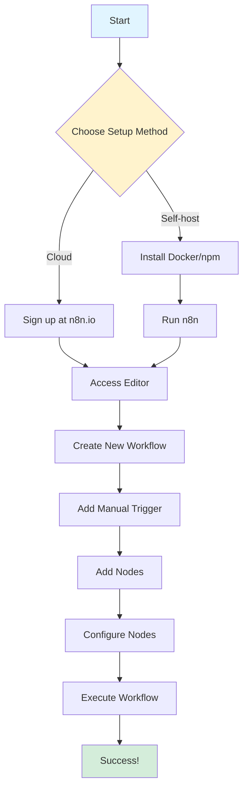

# n8n Quickstart Guide

> [!NOTE]
> This guide will get you from zero to running your first n8n workflow in under 5 minutes.

## Installation Options

n8n offers two main ways to get started:

### Option 1: n8n Cloud (Recommended for Beginners)

**Fastest way to start** - No installation required!

1. **Sign up**: Go to [https://n8n.io/](https://n8n.io/)
2. **Create account**: Click "Start Free" and create your account
3. **Access editor**: You'll be taken directly to the workflow editor
4. **Done!** You're ready to create workflows

> [!TIP]
> **Free tier includes**: Unlimited workflows, 1000 workflow executions per month, and access to all core features.

### Option 2: Self-Hosted Installation

For full control over your data and infrastructure.

#### Using Docker (Easiest)

```bash
docker run -it --rm \
  --name n8n \
  -p 5678:5678 \
  -v ~/.n8n:/home/node/.n8n \
  docker.n8n.io/n8nio/n8n
```

**What this does:**
- Runs n8n in a Docker container
- Maps port 5678 (access at `http://localhost:5678`)
- Persists data in `~/.n8n` directory

**Access n8n**: Open `http://localhost:5678` in your browser

#### Using npm (Alternative)

```bash
npm install n8n -g
n8n start
```

> [!WARNING]
> **Self-hosting considerations**: You'll need to handle updates, backups, and security yourself. Cloud version handles all of this automatically.

## Your First Workflow

Let's create a simple "Hello World" workflow that demonstrates the basics.

### Step 1: Create New Workflow

1. Click **"New Workflow"** button (top left)
2. You'll see an empty canvas

### Step 2: Add a Manual Trigger

1. Click the **"+"** button in the center
2. Search for **"Manual Trigger"**
3. Click to add it

> [!NOTE]
> **Manual Trigger** lets you run the workflow on-demand by clicking "Execute Workflow"

### Step 3: Add a Set Node

1. Click the **"+"** after the Manual Trigger
2. Search for **"Set"**
3. Add the Set node

### Step 4: Configure the Set Node

1. Click the **Set** node to open its configuration
2. In the **"Keep Only Set Fields"** section:
   - Click **"Add Value"**
   - Set **Name**: `message`
   - Set **Value**: `Hello from n8n!`
3. Click **"Execute Node"** to test

### Step 5: Add Output

1. Click **"+"** after the Set node
2. Search for **"Code"**
3. Add the Code node
4. In the Code node:
   - Set **Mode**: `Run Once for All Items`
   - In the code editor, type:
   ```javascript
   return items.map(item => {
     return {
       json: {
         output: item.json.message
       }
     };
   });
   ```

### Step 6: Execute Your Workflow

1. Click **"Execute Workflow"** button (top right)
2. Watch the data flow through each node
3. Check the output in the Code node

**Congratulations!** You've created your first n8n workflow! 🎉

## Setup Flow Diagram



## Verification Steps

After installation, verify everything works:

### ✅ Cloud Version
- [ ] Can access editor at your n8n cloud URL
- [ ] Can create a new workflow
- [ ] Can add nodes to canvas
- [ ] Can execute a workflow

### ✅ Self-Hosted Version
- [ ] Docker container is running (`docker ps` shows n8n)
- [ ] Can access `http://localhost:5678`
- [ ] Can create a new workflow
- [ ] Can execute a workflow

## Next Steps

Now that you have n8n running:

1. **Learn the fundamentals**: Read [02-fundamentals.md](./02-fundamentals.md) to understand JSON, APIs, and data flow
2. **Explore templates**: Check out [workflow templates](https://n8n.io/workflows/) for inspiration
3. **Try the quickstart tutorial**: n8n has an interactive "Very Quick Quickstart" template
4. **Build something real**: Follow [04-practical-guide.md](./04-practical-guide.md) for step-by-step tutorials

## Common First-Time Issues

### Issue: Can't access n8n after Docker install

**Solution**: 
- Check if port 5678 is already in use: `lsof -i :5678`
- Try a different port: `-p 8080:5678` (then access at `http://localhost:8080`)

### Issue: Workflow won't execute

**Solution**:
- Make sure you've configured all required fields in nodes
- Check for error messages in node outputs (red indicators)
- Ensure trigger node is properly set up

### Issue: Data not flowing between nodes

**Solution**:
- Verify nodes are connected (line between nodes should be visible)
- Check that previous node has output data
- Use "Execute Node" to test each node individually

> [!TIP]
> **Pro Tip**: Always test nodes individually using "Execute Node" before connecting them. This helps isolate issues early.

## Quick Reference

| Action | How To |
|--------|--------|
| Create workflow | Click "New Workflow" |
| Add node | Click "+" button, search, click node |
| Connect nodes | Drag from output dot to input dot |
| Configure node | Click node, fill in fields |
| Test node | Click "Execute Node" |
| Run workflow | Click "Execute Workflow" |
| Save workflow | Ctrl+S / Cmd+S (auto-saves) |

Ready to learn more? Continue to [02-fundamentals.md](./02-fundamentals.md) to understand the core concepts!

