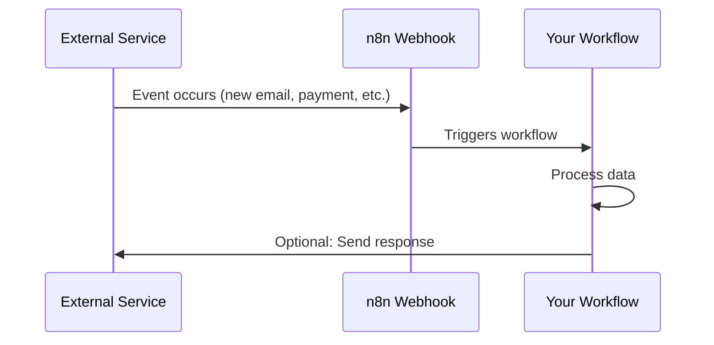
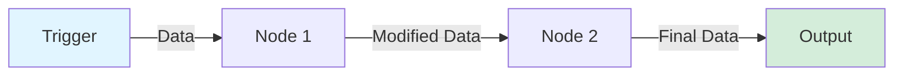

# n8n Fundamentals

> [!NOTE]
> This guide covers the essential background knowledge you need to effectively use n8n. Even if you're experienced with automation, understanding these concepts will make n8n much easier to use.

## Understanding JSON

JSON (JavaScript Object Notation) is the **language of data** in n8n. Every piece of information that flows through your workflows is in JSON format.

### What is JSON?

JSON is a way to structure data using:
- **Objects**: Collections of key-value pairs `{ "name": "John", "age": 30 }`
- **Arrays**: Lists of values `["apple", "banana", "orange"]`
- **Values**: Strings, numbers, booleans, null

### JSON Basics

```json
{
  "name": "John Doe",
  "email": "john@example.com",
  "age": 30,
  "active": true,
  "tags": ["developer", "automation"],
  "address": {
    "street": "123 Main St",
    "city": "San Francisco"
  }
}
```

**Key concepts:**
- **Keys** (left side): Always strings, in quotes
- **Values** (right side): Can be strings, numbers, booleans, arrays, or objects
- **Nested objects**: Objects can contain other objects
- **Arrays**: Lists of values, can contain any type

> [!TIP]
> **Visual Tip**: Think of JSON like a filing cabinet. Each key is a drawer label, and the value is what's inside that drawer.

### JSON in n8n

When data flows through n8n nodes, it's structured like this:

```json
{
  "json": {
    "field1": "value1",
    "field2": "value2"
  },
  "binary": {},
  "pairedItem": {}
}
```

- **`json`**: The actual data (this is what you'll work with most)
- **`binary`**: File attachments (images, PDFs, etc.)
- **`pairedItem`**: Internal tracking (you rarely need this)

> [!IMPORTANT]
> **Remember**: In n8n expressions, you access data using `$json.fieldName`, not just `fieldName`.

## Understanding APIs

APIs (Application Programming Interfaces) are how different services talk to each other.

### What is an API?

Think of an API like a **restaurant menu**:
- The **menu** (API documentation) tells you what you can order
- You place an **order** (API request) with specific items
- The **kitchen** (server) prepares your order
- You receive your **food** (API response)

### API Basics

**HTTP Methods:**
- **GET**: Retrieve data ("Give me user info")
- **POST**: Create new data ("Create a new user")
- **PUT**: Update existing data ("Update user info")
- **DELETE**: Remove data ("Delete this user")

**API Request Example:**
```
GET https://api.example.com/users/123
```

**API Response Example:**
```json
{
  "id": 123,
  "name": "John Doe",
  "email": "john@example.com"
}
```

### APIs in n8n

n8n nodes are essentially **API wrappers**. When you use a Gmail node to send an email, n8n makes an API call to Gmail's servers behind the scenes.

> [!TIP]
> **Why this matters**: Understanding APIs helps you debug when things go wrong. If a node fails, it's often because the API call failed (wrong credentials, invalid data, rate limits, etc.).

## Understanding Webhooks

Webhooks are **reverse APIs** - instead of you asking for data, services push data to you.

### What is a Webhook?

Imagine you order a package:
- **API (Polling)**: You keep calling the delivery company asking "Is it here yet?"
- **Webhook**: The delivery company calls you when the package arrives

### Webhook Flow



### Webhooks in n8n

**Common webhook triggers:**
- **Gmail**: New email arrives
- **Stripe**: Payment received
- **GitHub**: Code pushed
- **Slack**: Message posted
- **Custom**: Your own app sends data

> [!WARNING]
> **Security**: Webhooks are public URLs. Always use authentication (webhook path, headers, or query parameters) to prevent unauthorized access.

## Understanding Data Flow

Data in n8n flows **linearly** through nodes, like water through pipes.

### Data Flow Concept



**Key principles:**
1. **Each node receives data** from the previous node
2. **Each node can modify data** (add, remove, transform)
3. **Data flows forward** (left to right, top to bottom)
4. **Multiple items** can flow through (arrays of data)

### Data Transformation Example

**Input** (from Trigger):
```json
{
  "json": {
    "firstName": "John",
    "lastName": "Doe"
  }
}
```

**After Set Node** (adds fullName):
```json
{
  "json": {
    "firstName": "John",
    "lastName": "Doe",
    "fullName": "John Doe"
  }
}
```

**After Code Node** (transforms to uppercase):
```json
{
  "json": {
    "firstName": "JOHN",
    "lastName": "DOE",
    "fullName": "JOHN DOE"
  }
}
```

## Key Terminology

| Term | Definition | Example |
|------|------------|---------|
| **Node** | A single step in a workflow | Gmail node, Set node, Code node |
| **Workflow** | A series of connected nodes | Your entire automation |
| **Trigger** | A node that starts a workflow | Webhook, Schedule, Manual |
| **Item** | A single piece of data flowing through | One email, one row, one record |
| **Expression** | Code that accesses/transforms data | `$json.email`, `{{ $json.name }}` |
| **Execution** | One run of a workflow | Clicking "Execute Workflow" |
| **Credential** | Stored authentication info | Gmail OAuth, API keys |

## Why These Concepts Matter

### JSON Understanding Helps You:
- Access data correctly in expressions
- Debug data flow issues
- Transform data between formats
- Understand node outputs

### API Understanding Helps You:
- Debug connection issues
- Understand rate limits
- Know when to use which HTTP method
- Troubleshoot authentication problems

### Webhook Understanding Helps You:
- Set up event-driven automations
- Secure your webhooks
- Understand real-time triggers
- Debug webhook delivery issues

### Data Flow Understanding Helps You:
- Design efficient workflows
- Debug where data gets lost
- Understand branching and merging
- Optimize workflow performance

## Common Misconceptions

### ❌ "I need to know programming to use n8n"
**Reality**: n8n is visual and no-code friendly. Basic JSON understanding is helpful but not required.

### ❌ "Each node creates new data"
**Reality**: Nodes modify existing data. The data structure persists unless explicitly changed.

### ❌ "Webhooks are complicated"
**Reality**: Webhooks are just URLs that receive data. n8n handles the complexity for you.

### ❌ "I need to understand all APIs"
**Reality**: n8n nodes abstract away API complexity. You just configure fields, and n8n handles the API calls.

## Practice Exercise

Try this mental exercise:

1. **Imagine a workflow**: Gmail trigger → Extract email subject → Send to Slack
2. **Trace the data**:
   - Gmail trigger outputs: `{ "subject": "Hello", "body": "..." }`
   - Extract node outputs: `{ "subject": "Hello" }`
   - Slack node receives: `{ "subject": "Hello" }` and sends it

> [!TIP]
> **Learning Strategy**: When building workflows, always check the output of each node to see what data is available. This helps you understand data flow in practice.

## Next Steps

Now that you understand the fundamentals:

1. **Learn core concepts**: Read [03-core-concepts.md](./03-core-concepts.md) to understand nodes, expressions, and workflows
2. **Practice**: Try building a simple workflow using what you learned
3. **Explore**: Check out workflow templates to see these concepts in action

Ready to dive deeper? Continue to [03-core-concepts.md](./03-core-concepts.md)!

