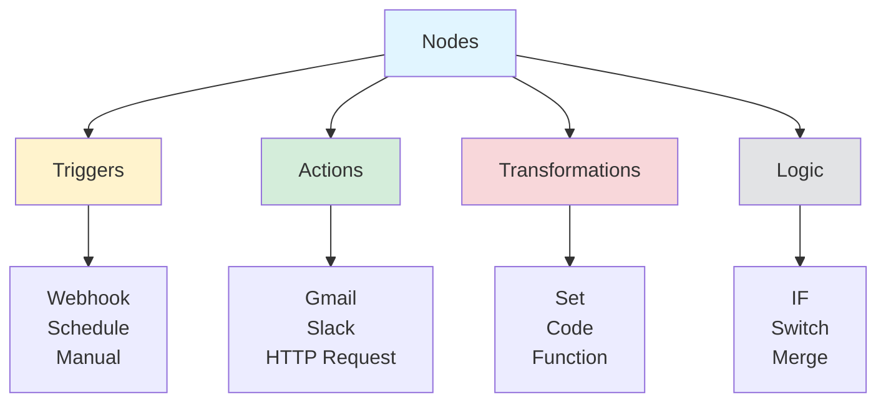
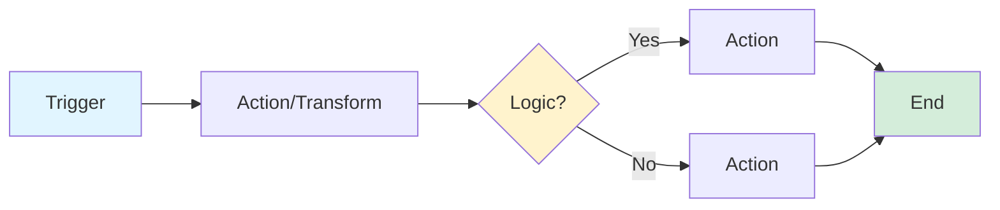

# n8n Core Concepts

> [!NOTE]
> This guide covers the essential concepts that make n8n powerful: nodes, expressions, triggers, and workflow design patterns.

## Understanding Nodes

Nodes are the **building blocks** of n8n workflows. Each node performs a specific action or transformation.

### Node Types



### Trigger Nodes

**Purpose**: Start workflows automatically or on-demand

**Common Triggers:**
- **Manual Trigger**: Run workflow manually
- **Schedule Trigger**: Run on a schedule (cron)
- **Webhook Trigger**: Receive HTTP requests
- **Gmail Trigger**: New email arrives
- **Slack Trigger**: New message in channel

> [!IMPORTANT]
> **Rule**: Every workflow must have exactly one trigger node. It's the entry point.

### Action Nodes

**Purpose**: Perform actions with external services

**Common Actions:**
- **Gmail**: Send email, read emails
- **Slack**: Send messages, create channels
- **HTTP Request**: Call any API
- **Google Sheets**: Read/write spreadsheet data
- **Database**: Query databases

### Transformation Nodes

**Purpose**: Modify or transform data

**Common Transformations:**
- **Set**: Add, remove, or modify fields
- **Code**: Write JavaScript/Python to transform data
- **Function**: Built-in functions for common operations
- **Split In Batches**: Process data in chunks

### Logic Nodes

**Purpose**: Control workflow flow based on conditions

**Common Logic:**
- **IF**: Branch based on condition
- **Switch**: Multiple branches based on value
- **Merge**: Combine multiple data streams
- **Wait**: Pause workflow execution

## Understanding Expressions

Expressions are **code snippets** that access and manipulate data in n8n. They use `{{ }}` syntax.

### Expression Basics

**Access data:**
```javascript
{{ $json.email }}           // Get email field
{{ $json.user.name }}       // Nested access
{{ $json.items[0] }}       // Array access
```

**Built-in variables:**
- `$json`: Current item's data
- `$binary`: Binary data (files)
- `$node`: Access other nodes' data
- `$workflow`: Workflow metadata
- `$execution`: Execution metadata

### Common Expression Patterns

**String operations:**
```javascript
{{ $json.name.toUpperCase() }}                    // "JOHN"
{{ $json.email.split('@')[0] }}                  // username from email
{{ $json.firstName + ' ' + $json.lastName }}     // Concatenate
```

**Math operations:**
```javascript
{{ $json.price * 1.1 }}                          // Add 10%
{{ Math.round($json.rating) }}                   // Round number
{{ $json.items.length }}                          // Array length
```

**Conditional logic:**
```javascript
{{ $json.age >= 18 ? 'Adult' : 'Minor' }}       // Ternary
{{ $json.status === 'active' ? true : false }}   // Boolean
```

**Date operations:**
```javascript
{{ $now }}                                       // Current timestamp
{{ $now.toISOString() }}                         // ISO format
{{ $now.plus({days: 7}) }}                       // Add 7 days
```

> [!TIP]
> **Expression Helper**: Click the "=" button next to any field to open the expression editor with autocomplete and examples.

### Expression Selectors

n8n provides **selectors** for common data access patterns:

```javascript
{{ $json.email }}              // Current item's email
{{ $('Gmail').item.json.subject }}  // Gmail node's subject
{{ $input.item.json.id }}     // First input item's id
{{ $input.all() }}            // All input items
{{ $input.first() }}          // First input item
{{ $input.last() }}           // Last input item
```

## Workflow Architecture

### Basic Workflow Structure



### Linear Workflow

**Simple, sequential flow:**
```
Trigger → Node 1 → Node 2 → Node 3
```

**Use when**: Simple automation with no branching

### Branching Workflow

**Conditional paths:**
```
Trigger → IF Node
         ├─→ [True] → Action A
         └─→ [False] → Action B
```

**Use when**: Different actions based on conditions

### Parallel Processing

**Multiple paths simultaneously:**
```
Trigger → Split
         ├─→ Path 1 → Action A
         ├─→ Path 2 → Action B
         └─→ Path 3 → Action C
```

**Use when**: Independent operations that don't depend on each other

### Merging Workflows

**Combine multiple streams:**
```
Trigger A ──┐
            ├─→ Merge → Action
Trigger B ──┘
```

**Use when**: Combining data from multiple sources

## Data Flow Patterns

### Single Item Flow

**One item flows through:**
```
Trigger (1 item) → Node (1 item) → Node (1 item)
```

**Example**: Process one email at a time

### Multiple Items Flow

**Array of items flows through:**
```
Trigger (5 items) → Node (5 items) → Node (5 items)
```

**Example**: Process multiple emails in one execution

### Item Splitting

**Split one item into multiple:**
```
Trigger (1 item) → Split (3 items) → Process each
```

**Example**: One order with multiple line items → process each item separately

### Item Merging

**Combine multiple items into one:**
```
Trigger (3 items) → Aggregate → Single result
```

**Example**: Calculate total from multiple order items

## Node Configuration

### Common Configuration Fields

**Authentication:**
- **Credential**: Select stored credentials (OAuth, API keys)
- **Connection**: Configure connection settings

**Operation:**
- **Resource**: What to do (send email, create record, etc.)
- **Operation**: Specific action (create, read, update, delete)

**Data Mapping:**
- **Fields**: Map data to API fields
- **Expressions**: Use expressions for dynamic values

### Configuration Best Practices

> [!TIP]
> **Use expressions for dynamic values**: Instead of hardcoding, use `{{ $json.email }}` to make nodes dynamic.

> [!WARNING]
> **Always test nodes individually**: Use "Execute Node" before connecting to next node to catch errors early.

> [!IMPORTANT]
> **Save credentials securely**: Never hardcode credentials. Use n8n's credential system.

## Workflow Execution Modes

### Manual Execution

**When**: You click "Execute Workflow"

**Use for**: Testing, one-off tasks, debugging

### Automatic Execution

**When**: Trigger fires (webhook, schedule, event)

**Use for**: Production automations, real-time processing

### Test Mode

**When**: "Execute Node" on individual nodes

**Use for**: Development, debugging, testing configurations

## Error Handling

### Error Node

**Purpose**: Catch and handle errors gracefully

**Pattern:**
```
Main Flow → [Error] → Error Handler Node
```

**Example:**
```
Gmail → Process → [Error] → Send Alert Email
```

### Error Handling Best Practices

1. **Always handle errors**: Don't let workflows fail silently
2. **Log errors**: Use error nodes to log what went wrong
3. **Notify on critical errors**: Send alerts for important failures
4. **Retry logic**: Use retry nodes for transient failures

## Workflow Design Patterns

### Pattern 1: Extract-Transform-Load (ETL)

```
Source → Extract → Transform → Load → Destination
```

**Example**: Gmail → Extract data → Format → Save to database

### Pattern 2: Event-Driven

```
Event → Webhook → Process → Action → Notification
```

**Example**: Payment received → Process → Update order → Send confirmation

### Pattern 3: Scheduled Batch

```
Schedule → Fetch Data → Process Batch → Update System
```

**Example**: Daily schedule → Fetch reports → Process → Update dashboard

### Pattern 4: Approval Workflow

```
Trigger → Check Condition → [Approved] → Action
                    └─→ [Rejected] → Notification
```

**Example**: Expense submission → Check amount → Approve or reject

## Advanced Concepts

### Loops

**Iterate over arrays:**
```
Trigger → Loop Over Items → Process Each → Aggregate
```

**Use**: Process each item in an array individually

### Sub-workflows

**Call other workflows:**
```
Main Workflow → Execute Workflow Node → Sub-workflow
```

**Use**: Reusable logic, modular design

### Variables

**Store workflow-level data:**
```
Set Variable → Use in Multiple Nodes
```

**Use**: Share data across nodes without passing through each one

## Common Node Combinations

### Email Processing
```
Gmail Trigger → Extract Data → Set Fields → Send to Slack
```

### Data Synchronization
```
Schedule → Fetch from API → Transform → Update Database
```

### Notification System
```
Webhook → Process → IF Condition → Send Notification
```

### Form Submission
```
Webhook → Validate → Save to Database → Send Confirmation
```

## Next Steps

Now that you understand core concepts:

1. **Build workflows**: Try [04-practical-guide.md](./04-practical-guide.md) for step-by-step tutorials
2. **Learn troubleshooting**: Read [05-common-problems.md](./05-common-problems.md) for common issues
3. **Optimize**: Check [06-tips-and-tricks.md](./06-tips-and-tricks.md) for productivity tips

Ready to build something real? Continue to [04-practical-guide.md](./04-practical-guide.md)!

