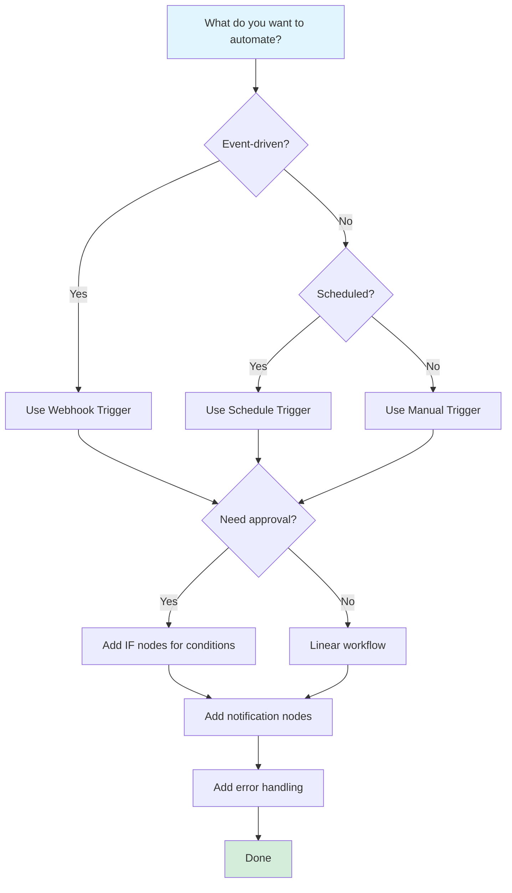

# n8n Practical Guide

> [!NOTE]
> This guide provides step-by-step tutorials for real-world automation scenarios. Follow along to build practical workflows you can use immediately.

## Tutorial 1: Email to Slack Notification

**Goal**: Automatically send Slack notifications when you receive important emails.

### Step 1: Set Up Gmail Trigger

1. Create new workflow
2. Add **Gmail Trigger** node
3. Configure:
   - **Credential**: Connect your Gmail account (OAuth)
   - **Trigger**: "New Email"
   - **Filters**: 
     - **From**: `important@example.com` (optional)
     - **Subject Contains**: `URGENT` (optional)

### Step 2: Extract Email Data

1. Add **Set** node after Gmail trigger
2. Configure to extract:
   - **From**: `{{ $json.from }}`
   - **Subject**: `{{ $json.subject }}`
   - **Body**: `{{ $json.textPlain }}`
   - **Date**: `{{ $json.date }}`

### Step 3: Send to Slack

1. Add **Slack** node
2. Configure:
   - **Credential**: Connect Slack workspace
   - **Resource**: "Message"
   - **Operation**: "Post Message"
   - **Channel**: `#notifications`
   - **Text**: 
     ```
     📧 New Email Alert
     From: {{ $json.from }}
     Subject: {{ $json.subject }}
     Date: {{ $json.date }}
     ```

### Step 4: Test

1. Click "Execute Workflow"
2. Send yourself a test email
3. Check Slack for notification

> [!TIP]
> **Pro Tip**: Add an IF node to only send notifications for emails matching certain criteria (sender, subject keywords, etc.).

## Tutorial 2: Form Submission to Database

**Goal**: Save form submissions to a database automatically.

### Step 1: Create Webhook

1. Add **Webhook** trigger node
2. Configure:
   - **HTTP Method**: POST
   - **Path**: `form-submission`
   - **Response Mode**: "Last Node"
3. **Copy the webhook URL** (you'll need this for your form)

### Step 2: Validate Data

1. Add **IF** node
2. Configure condition:
   - **Condition**: "All must be true"
   - **Rules**:
     - `{{ $json.name }}` exists
     - `{{ $json.email }}` exists
     - `{{ $json.email }}` contains "@"

### Step 3: Save to Database

1. Add **PostgreSQL** node (or your database)
2. Configure:
   - **Credential**: Database connection
   - **Operation**: "Insert"
   - **Table**: `form_submissions`
   - **Columns**: Map form fields to database columns
     - `name`: `{{ $json.name }}`
     - `email`: `{{ $json.email }}`
     - `message`: `{{ $json.message }}`
     - `created_at`: `{{ $now }}`

### Step 4: Send Confirmation

1. Add **Gmail** node
2. Configure:
   - **Operation**: "Send Email"
   - **To**: `{{ $json.email }}`
   - **Subject**: "Thank you for your submission"
   - **Body**: "We received your message and will get back to you soon."

### Step 5: Handle Errors

1. Add **Error Trigger** node
2. Connect error path to **Gmail** node (send error notification)
3. Configure error email to notify admin

**Workflow Structure:**
```
Webhook → IF (Validate) → PostgreSQL → Gmail (Confirmation)
              └─→ [Error] → Gmail (Error Alert)
```

## Tutorial 3: Daily Report Automation

**Goal**: Generate and email a daily report automatically.

### Step 1: Schedule Trigger

1. Add **Schedule Trigger** node
2. Configure:
   - **Trigger Times**: "Every day at 9:00 AM"
   - **Timezone**: Your timezone

### Step 2: Fetch Data

1. Add **HTTP Request** node
2. Configure:
   - **Method**: GET
   - **URL**: `https://api.example.com/daily-stats`
   - **Authentication**: API key (if needed)

### Step 3: Process Data

1. Add **Code** node
2. Configure:
   - **Mode**: "Run Once for All Items"
   - **Code**:
   ```javascript
   const data = $input.all();
   const summary = {
     totalUsers: data[0].json.totalUsers,
     newSignups: data[0].json.newSignups,
     revenue: data[0].json.revenue,
     date: $now.toFormat('yyyy-MM-dd')
   };
   
   return [{ json: summary }];
   ```

### Step 4: Format Report

1. Add **Set** node
2. Configure to create report:
   - **subject**: `Daily Report - {{ $json.date }}`
   - **body**: 
     ```
     Daily Report for {{ $json.date }}
     
     Total Users: {{ $json.totalUsers }}
     New Signups: {{ $json.newSignups }}
     Revenue: ${{ $json.revenue }}
     ```

### Step 5: Send Email

1. Add **Gmail** node
2. Configure:
   - **To**: `team@example.com`
   - **Subject**: `{{ $json.subject }}`
   - **Body**: `{{ $json.body }}`

## Tutorial 4: File Processing Pipeline

**Goal**: Process files uploaded via webhook and save to cloud storage.

### Step 1: Receive File

1. Add **Webhook** trigger
2. Configure:
   - **HTTP Method**: POST
   - **Path**: `upload-file`
   - **Response Mode**: "Last Node"

### Step 2: Validate File

1. Add **IF** node
2. Configure:
   - **Condition**: `{{ $binary.data }}` exists
   - **AND**: `{{ $binary.fileName }}` ends with ".pdf" or ".jpg"

### Step 3: Process File

1. Add **Code** node
2. Configure:
   ```javascript
   const fileName = $binary.fileName;
   const fileExtension = fileName.split('.').pop();
   const timestamp = Date.now();
   const newFileName = `${timestamp}-${fileName}`;
   
   return [{
     json: {
       originalName: fileName,
       newName: newFileName,
       extension: fileExtension,
       size: $binary.fileSize
     },
     binary: {
       data: $binary.data
     }
   }];
   ```

### Step 4: Upload to Storage

1. Add **Google Drive** node (or Dropbox, S3, etc.)
2. Configure:
   - **Operation**: "Upload"
   - **File Name**: `{{ $json.newName }}`
   - **Binary Data**: `{{ $binary.data }}`
   - **Folder**: `/uploads/{{ $json.extension }}`

### Step 5: Save Metadata

1. Add **PostgreSQL** node
2. Configure to save file metadata:
   - `original_name`: `{{ $json.originalName }}`
   - `stored_name`: `{{ $json.newName }}`
   - `file_size`: `{{ $json.size }}`
   - `uploaded_at`: `{{ $now }}`

## Tutorial 5: Multi-Step Approval Workflow

**Goal**: Create an approval workflow with multiple steps.

### Step 1: Receive Request

1. Add **Webhook** trigger
2. Configure to receive approval request:
   ```json
   {
     "requestId": "123",
     "requester": "john@example.com",
     "amount": 5000,
     "description": "New equipment purchase"
   }
   ```

### Step 2: Check Amount

1. Add **IF** node
2. Configure:
   - **Condition**: `{{ $json.amount }}` > 1000
   - **True**: Requires approval
   - **False**: Auto-approve

### Step 3: Request Approval

1. Add **Gmail** node (for approval request)
2. Configure:
   - **To**: `manager@example.com`
   - **Subject**: `Approval Request: {{ $json.description }}`
   - **Body**: Include approval link with request ID

### Step 4: Wait for Response

1. Add **Webhook** node (for approval response)
2. Configure:
   - **Path**: `approval-response`
   - **Expected data**: `{ "requestId": "123", "approved": true }`

### Step 5: Process Decision

1. Add **IF** node
2. Configure:
   - **Condition**: `{{ $json.approved }}` === true
   - **True**: Process request
   - **False**: Reject and notify

### Step 6: Notify Requester

1. Add **Gmail** node
2. Configure to send approval/rejection notification

**Workflow Structure:**
```
Webhook (Request) → IF (Amount Check) → Gmail (Request Approval)
                                        └─→ [Auto-approve] → Process
                    Webhook (Response) → IF (Approved?) → Process/Reject
```

## Tutorial 6: Data Synchronization

**Goal**: Keep two systems in sync (e.g., CRM and database).

### Step 1: Fetch Source Data

1. Add **Schedule Trigger** (runs every hour)
2. Add **HTTP Request** node
3. Configure to fetch data from source system

### Step 2: Compare with Target

1. Add **PostgreSQL** node
2. Configure to fetch existing records
3. Add **Code** node to compare:
   ```javascript
   const sourceData = $input.first().json;
   const existingData = $('PostgreSQL').all();
   
   // Find differences
   const newRecords = sourceData.filter(item => 
     !existingData.some(existing => existing.id === item.id)
   );
   
   const updatedRecords = sourceData.filter(item => {
     const existing = existingData.find(e => e.id === item.id);
     return existing && existing.updatedAt !== item.updatedAt;
   });
   
   return [{
     json: {
       new: newRecords,
       updated: updatedRecords
     }
   }];
   ```

### Step 3: Update Target System

1. Add **Loop Over Items** node
2. Add **PostgreSQL** node inside loop
3. Configure to insert/update records

### Step 4: Log Sync Results

1. Add **Set** node to create log entry
2. Add **PostgreSQL** node to save sync log

## Decision Tree: Choosing the Right Pattern



## Best Practices for Practical Workflows

### 1. Always Validate Input

> [!IMPORTANT]
> **Never trust input data**. Always validate webhook data, form submissions, and API responses before processing.

### 2. Handle Errors Gracefully

> [!WARNING]
> **Every workflow should have error handling**. Use Error Trigger nodes to catch and handle errors.

### 3. Use Meaningful Node Names

> [!TIP]
> **Name your nodes descriptively**: "Validate Email" instead of "IF", "Send Slack Alert" instead of "Slack".

### 4. Test Incrementally

> [!TIP]
> **Test each node individually** before connecting to the next. This makes debugging much easier.

### 5. Document Your Workflows

> [!NOTE]
> **Add descriptions to nodes** explaining what they do. Future you will thank you!

## Next Steps

Now that you've built practical workflows:

1. **Troubleshoot issues**: Read [05-common-problems.md](./05-common-problems.md)
2. **Optimize workflows**: Check [06-tips-and-tricks.md](./06-tips-and-tricks.md)
3. **Go advanced**: Explore [07-advanced-topics.md](./07-advanced-topics.md)

Ready to solve problems? Continue to [05-common-problems.md](./05-common-problems.md)!

