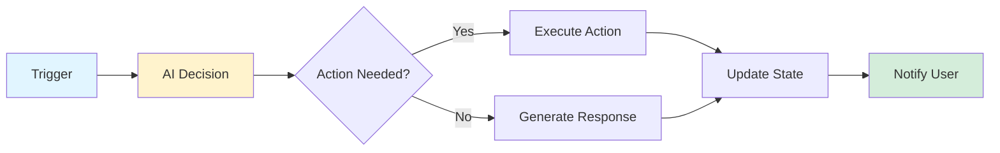

# n8n Advanced Topics

> [!NOTE]
> This guide covers advanced features and patterns for power users: AI integration, custom nodes, scaling, enterprise features, and complex workflow architectures.

## AI Integration

n8n has powerful AI capabilities that let you build intelligent automations.

### OpenAI Integration

**Use ChatGPT/GPT-4 in workflows:**

1. Add **OpenAI** node
2. Configure:
   - **Operation**: "Chat" or "Complete"
   - **Model**: Choose GPT-3.5 or GPT-4
   - **Messages**: Define conversation context
   - **Temperature**: Control creativity (0-2)

**Example - AI Email Response:**
```
Gmail Trigger → Extract Email → OpenAI (Generate Response) → Send Reply
```

**OpenAI Configuration:**
- **System Message**: Set AI behavior/role
- **User Message**: `{{ $json.emailBody }}`
- **Response**: AI-generated reply

### Building AI Agents

**Create autonomous AI agents:**



**AI Agent Pattern:**
1. **Receive input** (webhook, email, message)
2. **AI analyzes** what action is needed
3. **AI decides** which workflow path to take
4. **Execute action** (send email, update database, etc.)
5. **AI generates response** explaining what was done
6. **Notify user** with AI-generated summary

**Example Use Cases:**
- **Customer support agent**: Analyzes tickets, routes to correct team, generates responses
- **Content moderator**: Reviews submissions, flags issues, suggests actions
- **Data analyst**: Analyzes reports, generates insights, creates summaries

### AI Workflow Examples

**Smart Email Triage:**
```
Gmail → OpenAI (Categorize) → IF (Urgent) → Slack Alert
                            → IF (Spam) → Delete
                            → IF (Normal) → Archive
```

**Content Generation:**
```
Webhook (Request) → OpenAI (Generate Content) → Format → Publish → Notify
```

**Data Analysis:**
```
Schedule → Fetch Data → OpenAI (Analyze Trends) → Generate Report → Email
```

> [!TIP]
> **Cost Optimization**: Use GPT-3.5 for simple tasks, GPT-4 only when needed. Cache AI responses when possible.

## Custom Nodes

Create your own nodes for specialized functionality.

### When to Create Custom Nodes

**Create custom nodes when:**
- You need integration with service not available in n8n
- You have complex, reusable logic
- You want to simplify workflow for team
- You need specialized functionality

### Custom Node Structure

**Basic custom node:**
```typescript
import { INodeType, INodeTypeDescription } from 'n8n-workflow';

export class MyCustomNode implements INodeType {
  description: INodeTypeDescription = {
    displayName: 'My Custom Node',
    name: 'myCustomNode',
    icon: 'file:myCustomNode.svg',
    group: ['transform'],
    version: 1,
    description: 'Does something custom',
    defaults: {
      name: 'My Custom Node',
    },
    inputs: ['main'],
    outputs: ['main'],
    properties: [
      {
        displayName: 'Operation',
        name: 'operation',
        type: 'options',
        options: [
          {
            name: 'Do Something',
            value: 'doSomething',
          },
        ],
        default: 'doSomething',
      },
    ],
  };

  async execute(this: IExecuteFunctions): Promise<INodeExecutionData[][]> {
    // Your custom logic here
    return [items];
  }
}
```

### Custom Node Development

**Setup:**
1. Install n8n CLI: `npm install -g n8n`
2. Create node: `n8n create:node`
3. Develop in TypeScript
4. Test locally
5. Package and distribute

**Resources:**
- [n8n Node Development Docs](https://docs.n8n.io/integrations/creating-nodes/)
- [n8n Node Examples](https://github.com/n8n-io/n8n-nodes-base)

> [!WARNING]
> **Custom nodes require**: TypeScript knowledge, understanding of n8n architecture, and development setup.

## Scaling Workflows

### Horizontal Scaling

**Run multiple n8n instances:**
- Use load balancer
- Share database/queue
- Distribute workflow execution
- Handle high volume

**Architecture:**
```
Load Balancer → n8n Instance 1
             → n8n Instance 2
             → n8n Instance 3
             → Shared Database/Queue
```

### Queue System

**Use queue for async processing:**
- Redis queue for job distribution
- RabbitMQ for message queuing
- Process workflows asynchronously
- Handle spikes in traffic

**Pattern:**
```
Trigger → Add to Queue → Worker Processes → Complete
```

### Database Optimization

**Optimize for scale:**
- Use PostgreSQL for production
- Index frequently queried fields
- Archive old execution data
- Use read replicas for reporting

### Caching Strategy

**Cache aggressively:**
- Cache API responses
- Cache computed values
- Use Redis for distributed cache
- Invalidate cache on updates

## Enterprise Features

### Workflow Versioning

**Track workflow changes:**
- Version control for workflows
- Roll back to previous versions
- Compare versions
- Audit trail of changes

### User Management

**Role-based access:**
- Admin, Editor, Viewer roles
- Workflow-level permissions
- Team management
- SSO integration

### Audit Logging

**Track all actions:**
- Workflow executions
- User actions
- Configuration changes
- Security events

### High Availability

**Ensure uptime:**
- Multi-instance deployment
- Database replication
- Automated failover
- Health monitoring

## Complex Workflow Patterns

### Event Sourcing

**Track all events:**
```
Event → Log Event → Process → Update State → Notify
```

**Benefits:**
- Complete audit trail
- Replay events for debugging
- Time travel debugging
- Event replay for recovery

### Saga Pattern

**Distributed transactions:**
```
Start Transaction → Step 1 → Step 2 → Step 3 → Commit
                    └─→ [Error] → Compensate → Rollback
```

**Use for:**
- Multi-step processes
- Distributed systems
- Transaction management
- Error recovery

### Circuit Breaker

**Prevent cascade failures:**
```
Request → Check Circuit → [Open] → Fail Fast
        → [Closed] → Execute → [Success] → Reset
                    → [Failure] → Increment → [Threshold] → Open Circuit
```

**Benefits:**
- Prevents overwhelming failing services
- Fast failure detection
- Automatic recovery
- System resilience

### Retry with Exponential Backoff

**Handle transient failures:**
```
Request → [Success] → Continue
       → [Failure] → Wait (exponential) → Retry → [Max Retries] → Fail
```

**Implementation:**
- Start with 1 second delay
- Double delay each retry
- Max 5-10 retries
- Give up after threshold

## Advanced Data Processing

### Stream Processing

**Process data streams:**
```
Stream → Buffer → Process Batch → Aggregate → Output
```

**Use for:**
- Real-time data processing
- High-volume streams
- Continuous processing
- Event streams

### Data Transformation Pipelines

**Complex transformations:**
```
Input → Validate → Normalize → Enrich → Transform → Validate → Output
```

**Each stage:**
- Validates data quality
- Transforms format
- Enriches with additional data
- Outputs clean, structured data

### Machine Learning Integration

**Integrate ML models:**
```
Data → Preprocess → ML Model → Postprocess → Action
```

**Use cases:**
- Classification
- Prediction
- Anomaly detection
- Recommendation systems

## Security Advanced Topics

### OAuth 2.0 Flows

**Implement OAuth:**
- Authorization code flow
- Client credentials flow
- Refresh token management
- Token storage security

### API Key Rotation

**Automate key rotation:**
```
Schedule → Generate New Key → Update Services → Verify → Revoke Old Key
```

### Secrets Management

**Secure secret storage:**
- Use external secrets manager (Vault, AWS Secrets Manager)
- Never store secrets in workflows
- Rotate secrets regularly
- Audit secret access

### Network Security

**Secure network:**
- VPN for self-hosted
- Private networks
- Firewall rules
- Network segmentation

## Monitoring and Observability

### Metrics Collection

**Track key metrics:**
- Workflow execution time
- Success/failure rates
- API call counts
- Resource usage

### Logging Strategy

**Structured logging:**
- JSON format logs
- Include context (workflow ID, execution ID)
- Log levels (debug, info, warn, error)
- Centralized log aggregation

### Alerting

**Set up alerts:**
- Workflow failures
- High error rates
- Performance degradation
- Security events

### Dashboards

**Visualize metrics:**
- Grafana dashboards
- Custom monitoring
- Real-time metrics
- Historical trends

## Performance Tuning

### Workflow Optimization

**Optimize workflows:**
- Minimize node count
- Reduce API calls
- Use parallel processing
- Cache frequently accessed data

### Database Tuning

**Optimize database:**
- Proper indexing
- Query optimization
- Connection pooling
- Regular maintenance

### Resource Management

**Manage resources:**
- CPU usage monitoring
- Memory management
- Disk I/O optimization
- Network bandwidth

## Integration Patterns

### API Gateway Pattern

**Centralize API access:**
```
Workflows → API Gateway → External Services
```

**Benefits:**
- Single point of control
- Rate limiting
- Authentication
- Request/response transformation

### Service Mesh

**Microservices communication:**
- Service discovery
- Load balancing
- Circuit breaking
- Observability

### Event-Driven Architecture

**Event-based integration:**
```
Service A → Event Bus → n8n → Service B
```

**Benefits:**
- Loose coupling
- Scalability
- Resilience
- Real-time processing

## Next Steps

Now that you understand advanced topics:

1. **Reference resources**: Check [08-resources.md](./08-resources.md) for tools and libraries
2. **Quick lookup**: Use [09-cheatsheet.md](./09-cheatsheet.md) for syntax reference
3. **Practice**: Build complex workflows using these patterns

Ready to find more resources? Continue to [08-resources.md](./08-resources.md)!

